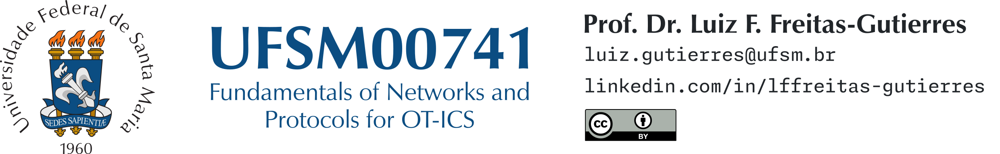
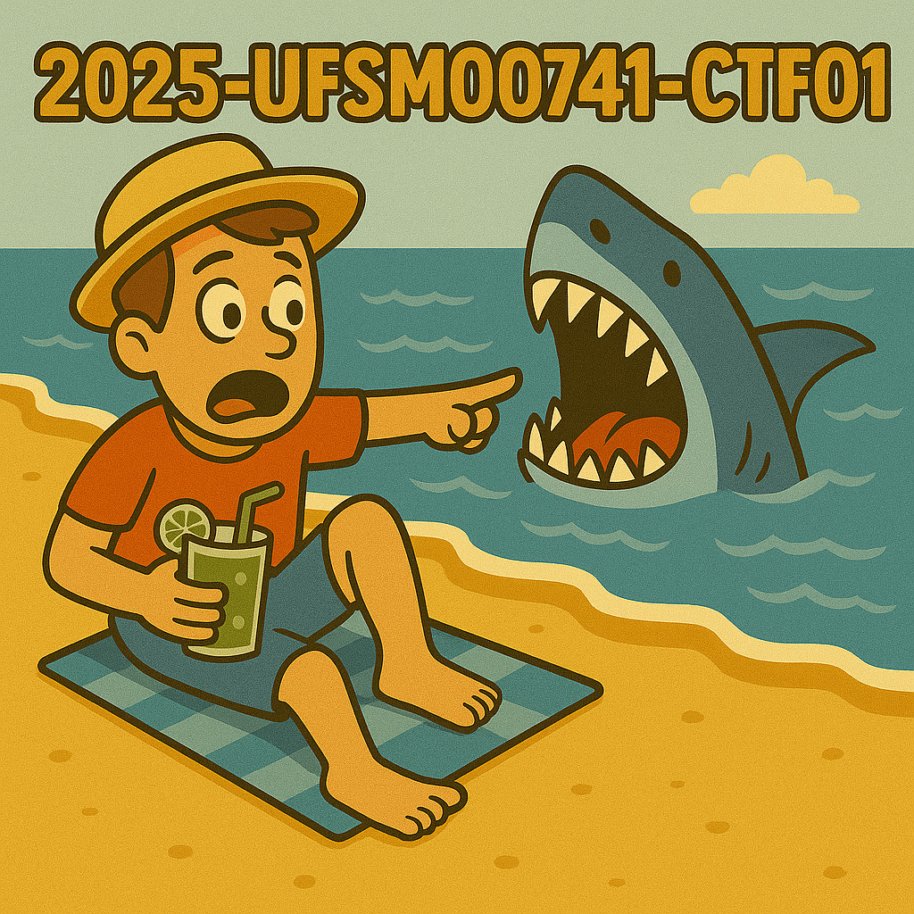

# UFSM00741 - Capture the Flag 01

- 🛠 **Procedures:**
    1. 🦈 Open the `CTF01.pcapng` file using Wireshark.
    2. 🦈 Examine the packet capture carefully and address the challenges presented below.
- ❓ **Challenges:**
    1. 🏁 What are the capture file comments? `UFSM00741{XxxxxxxxxXxxxxx}`
    2. 🏁 What is the total number of packets captured? `UFSM00741{XXX}`
    3. 🏁 What is the SHA256 hash value of the capture file? `UFSM00741{xxxxxxxxxxxxxxxxxxxxxxxxxxxxxxxxxxxxxxxxxxxxxxxxxxxxxxxxxxxxxxxx}`
    4. 🏁 What is the arrival time of packet no. 68? `UFSM00741{MM-DD-YYYY}`
    5. 🏁 What is the time to live (TTL) value of packet no. 68? `UFSM00741{xx}`
    6. 🏁 What is the TCP payload size of packet no. 68? `UFSM00741{xxx}`
    7. 🏁 Search for the string `r4w` in the packet details and identify the name of `artist 1`. `UFSM00741{xxxxxxx}`
    8. 🏁 Identify the flag in the packet comment of packet no. 176. `UFSM00741{XxxxXxXxXXXxXXX}`
    9. 🏁 A JPEG image was accessed by the user. Locate and export the corresponding packet bytes (it is the first JPEG image present in the capture). Then, calculate the `md5sum` of the resulting file. `UFSM00741{xxxxxxxxxxxxxxxxxxxxxxxxxxxxxxxx}`
    10. 🏁 Reconstruct the JPEG image from the previous challenge using [CyberChef](https://gchq.github.io/CyberChef/).
    11. 🏁 How many frames are marked as (suspected) retransmissions? `UFSM00741{xx}`
    12. 🏁 Locate the flag that is hidden within this Wireshark file. *No hint provided*

    