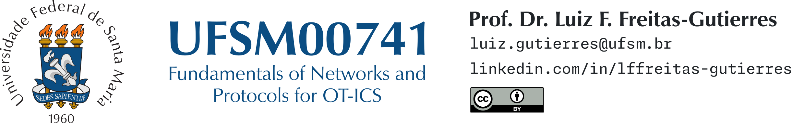

# UFSM00741 - Capture the Flag 02

- 🛠 **Procedures:**
    1. 🖥️ Extract the contents of the `CTF02-Student.zip` archive.
    2. 🖥️ Open the `CTF02-Student.xpr` project file using TwidoSuite by Schneider Electric.
    3. 🖥️ Review the configuration settings and analyze the Ladder Logic implemented in the project.
- ❓ **Challenges:**
    1. 🏁 The Ladder Logic program includes a hidden message transmitted through its sequence. Your task is to decode this message. The flag follows the format `UFSM00741{xxxxxxx}`, consisting of a sequence of seven lowercase letters.

  
   
  <em>Artwork for the second CTF of the UFSM00741 course (Second Semester, 2025).</em>

---

UFSM00741 . *Capture the Flag 02* . Second Semester, 2025 . 2025-10-20

[Prof. Dr. Luiz F. Freitas-Gutierres](https://www.linkedin.com/in/lffreitas-gutierres/)