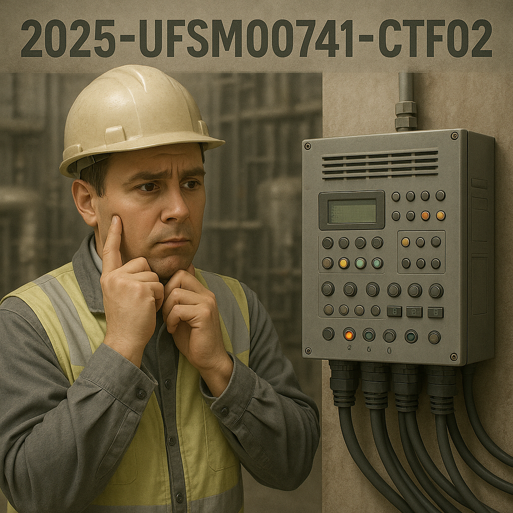

# UFSM00741 - Capture the Flag 02

## 👷 Control Logic Description

- Within the 13.8 kV sector of a substation, two three-phase capacitor banks (Bank A and Bank B) are installed for power factor correction during peak load periods.
- The switching and reclosing operations of these capacitor banks must be performed automatically based on operational logic.
- Automatic energization of the capacitor banks is permitted only when:
    - 👉 The `SAFE_COND` signal is active, indicating favorable operating conditions.
    - 👉 No protection alarms are active (`OSC_ALARM` for oscillations and `OC_ALARM` for overcurrent).
- The banks must be energized in a staggered sequence: Bank A is closed first. Bank B may only be energized after a programmed delay, provided all permissive conditions remain met.
- Once a bank is energized, the control logic must supervise for abnormal conditions for a duration equal to twice the closing delay (individually for each bank). If any disturbance is detected, the affected bank must be automatically tripped and latched in a blocked state until manually reset by the operator.
- If the local operator activates the `MANU_MOD`button, input, automatic control is overridden, and manual control via the human-machine interface (HMI) is enabled.
- The manual reset `RESET` clears all blocking flags and timer conditions, restoring the system to automatic operation readiness.
- If the power factor exceeds the permissible limit (`FP_HIGH`), both capacitor banks shall be blocked.

### 🧠 I/O Mapping and Symbols

| Symbol Name   | Type        | Description                                                 |
|---------------|-------------|-------------------------------------------------------------|
| `MODE_MANUAL` | Input       | Operator selection for manual control mode                  |
| `COND_SAFE`   | Input       | System permissive for capacitor switching (safe condition)  |
| `PF_HIGH`     | Input       | Power factor exceeds allowable threshold                    |
| `CMD_RESET`   | Input       | Manual reset for blocking flags and internal timers         |
| `FLT_OSC`     | Input       | Oscillation fault detection input                           |
| `FLT_OC`      | Input       | Overcurrent fault detection input                           |
| `CMD_BANK_A`  | Output      | Command to close capacitor Bank A                           |
| `CMD_BANK_B`  | Output      | Command to close capacitor Bank B                           |
| `ALM_GENERAL` | Output      | General alarm output                                        |
| `MODE_AUTO`   | Memory Bit  | Internal flag indicating automatic control mode             |
| `BLK_BANK_A`  | Memory Bit  | Blocking status for Bank A                                  |
| `BLK_BANK_B`  | Memory Bit  | Blocking status for Bank B                                  |
| `MEM_BANK_A`  | Memory Bit  | Recent actuation of Bank A                                  |
| `MEM_BANK_B`  | Memory Bit  | Recent actuation of Bank B                                  |
| `TRIP_BANK_A` | Memory Bit  | Trip condition detected in Bank A (oscillation/overcurrent) |
| `TRIP_BANK_B` | Memory Bit  | Trip condition detected in Bank B (oscillation/overcurrent) |
| `TMR_DELAY_1` | Memory Bit  | First timer condition                                       |
| `TMR_DELAY_2` | Memory Bit  | Second timer condition                                      |
| `TMR_DELAY_3` | Memory Bit  | Third timer condition                                       |

---

## 🪜 Task Instructions

1. Launch the `CTF02.xpr` project file using [Twido Suite by Schneider Electric](https://www.se.com/br/pt/faqs/FA278356/).
2. Review the ladder logic diagram and respond to the challenges listed below.

## 🏁 Challenges

> [!WARNING]  
> Flags for Challenges 01–24 must follow this format: `UFSM007414{Answer}`.
>
> Challenge 25 must be implemented directly in the `CTF02.xpr` file and saved as `CTF02-StudentName.xpr` (replace *StudentName* accordingly).

01. What is the model or reference number of the PLC hardware used?
02. How many input points are available on the PLC?
03. How many output points are available on the PLC?
04. What is the energization delay for Bank A under nominal conditions?
05. What is the total closing sequence time for Bank B under nominal conditions, starting from the energization of Bank A and including the full monitoring period for abnormal conditions?
06. Which input is mapped to address `%I0.0`?
07. Which input is mapped to address `%I0.1`?
08. Which input is mapped to address `%I0.2`?
09. Which input is mapped to address `%I0.3`?
10. Which input is mapped to address `%I0.4`?
11. Which input is mapped to address `%I0.5`?
12. Which output is mapped to address `%Q0.0`?
13. Which output is mapped to address `%Q0.1`?
14. Which output is mapped to address `%Q0.2`?
15. Which symbol corresponds to memory bit `%M0`?
16. Which symbol corresponds to memory bit `%M1`?
17. Which symbol corresponds to memory bit `%M2`?
18. Which symbol corresponds to memory bit `%M3`?
19. Which symbol corresponds to memory bit `%M4`?
20. Which symbol corresponds to memory bit `%M5`?
21. Which symbol corresponds to memory bit `%M6`?
22. Which symbol corresponds to memory bit `%M7`?
23. Which symbol corresponds to memory bit `%M8`?
24. Which symbol corresponds to memory bit `%M9`?
25. Develop a logic routine to count the number of automatic capacitor bank reclosing operations.

  
   
  <em>Artwork for the second CTF of course UFSM00741 (First Semester 2025).</em>

---

UFSM00741 . *Capture the Flag 02* . First Semester 2025 . 2025-05-06

[Prof. Dr. Luiz F. Freitas-Gutierres](https://www.linkedin.com/in/lffreitas-gutierres/)