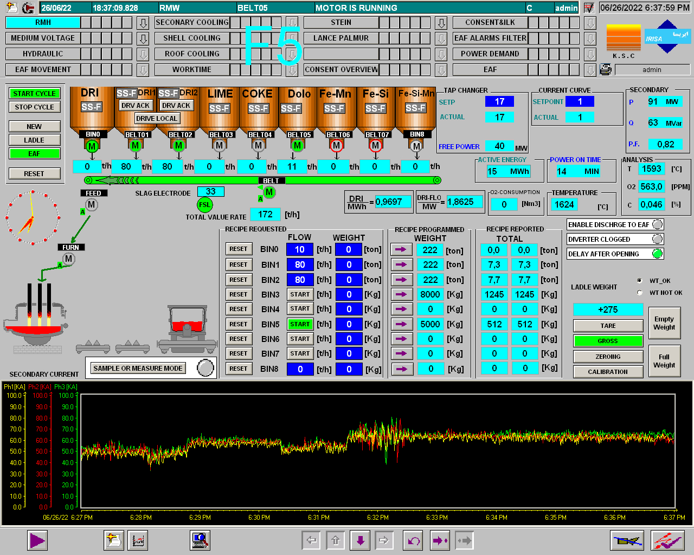
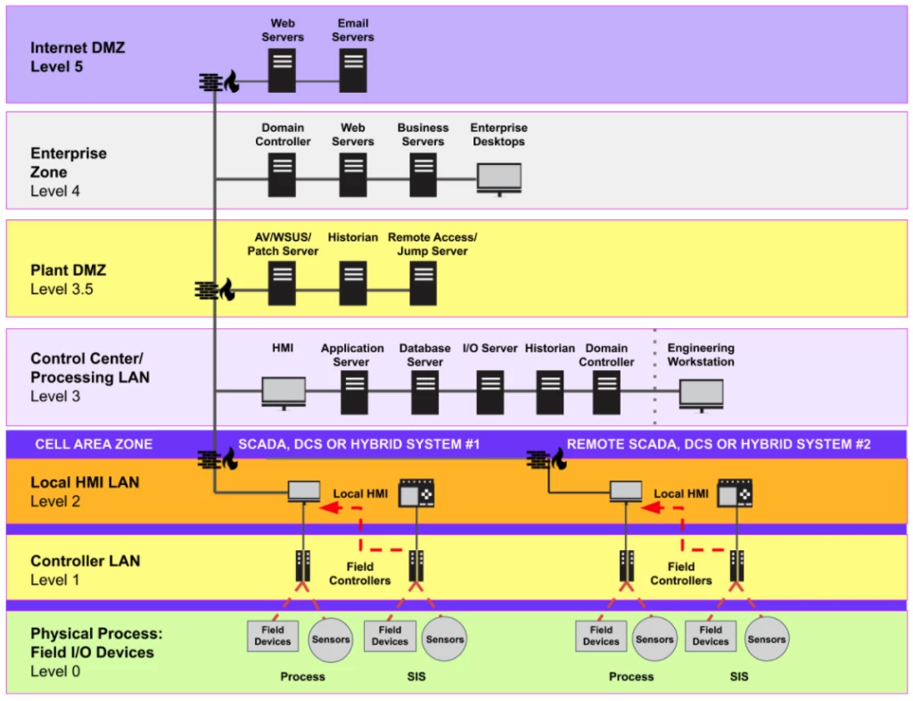
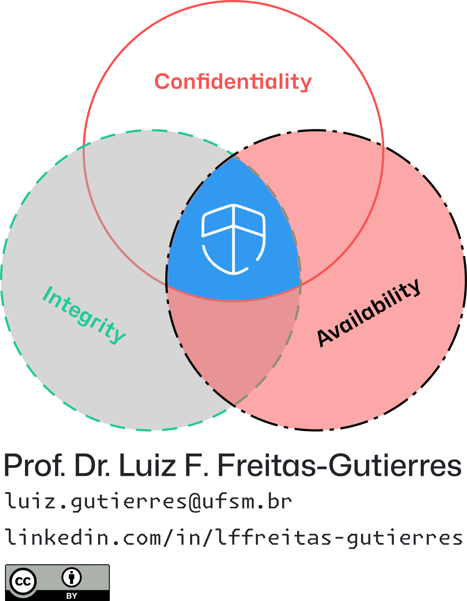
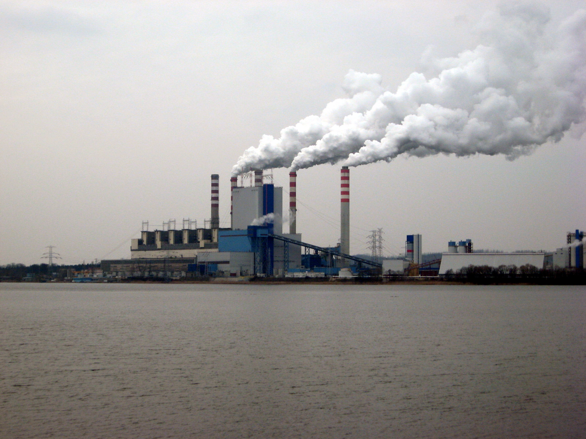

# UFSM00741 - Handout 01

## 📑 Table of Contents

- [👷 Industrial Control Systems](#-industrial-control-systems).
- [👷 Supervisory Control and Data Acquisition](#-supervisory-control-and-data-acquisition).
- [👷 Operational Technology](#-operational-technology).
- [👷 Critical Infrastructure](#-critical-infrastructure).

## 👷 Industrial Control Systems

  
   
  <em>Figure 01. Internal view of a panel containing a programmable logic controller (PLC) with input/output (I/O) modules. Source: <a href="https://web.archive.org/web/20250216112644/https://www.m-controls.com/solutions/plc-automation/" target="_blank">Millennium Control Systems (2025)</a>.</em>

- Industrial control systems (ICS) generate outputs based on the current state of their inputs, according to to internal configurations and programmed logic.
- ICS are designed to control variables within the **physical domain**, whereas information technology (IT) systems primarily **manage data and information flow**.
- Among the field-level devices found in ICS environments are:
  - 1️⃣ **Programmable logic controllers (PLC)**.
      - PLC inputs are connected to **sensors** (e.g., temperature, pressure, position switches) that monitor physical process variables.
      - PLC outputs are connected to **actuators** (e.g., relays, valves, or mechanical positioners) that manipulate physical parameters in real time.
      - PLCs can be either compact or modular, with modular units typically connected via a backplane and installed in a common rack.
      - [🌐 Example: Siemens LOGO! modular PLC](https://www.siemens.com/br/pt/produtos/automacao/controladores/logo/modulo-pequenos-projetos.html).
      - [🎬 Recommended video 01](https://youtu.be/tSIH4dOYF0c).
  - 2️⃣ **Remote telemetry units (RTU)**.
      - Also referred to as **remote terminal units** or **remote telecontrol units**.
      - Compared to PLC, RTU typically offer greater tolerance to harsh environmental conditions and are often deployed in remote field locations, particularly in distributed control system (DCS) architectures.
      - They are equipped with local control capabilities and internal memory for autonomous operation.
      - [🌐 Example: Smart RTU SCADAPack](https://www.se.com/br/pt/product-range/35344468-scadapack-47x-47xi/?parent-subcategory-id=6040#products).
      - [🎬 Recommended video 02](https://youtu.be/Ax1jTp2dl9M).
  - 3️⃣ **Intelligent electronic devices (IED)**.
      - IED are a specialized form of RTU that provide integrated protection, control, monitoring, and automation functionalities. They are commonly deployed in power generation and distribution infrastructure.
      - Typical examples of IED include intelligent protective relays, digital fault recorders, and smart meters, among others.
      - [🌐 Example: SEL-487E transformer protection relay](https://selinc.com/pt/products/487E/).

> [!NOTE]
> - ICS typically require high availability, followed by data integrity.
> - ICS demand very short response times and frequently operate in real-time.
> - ICS usually lack user-friendly interfaces (e.g., keyboards, touchscreens, or displays); instead, they offer I/O ports for connecting external components such as actuators and sensors.
> - ICS are physically hardened and engineered to operate reliably under industrial or harsh environmental conditions.

## 👷 Supervisory Control and Data Acquisition

  
   
  <em>Figure 02. Screenshot of a SCADA interface from a steel plant leaked during a cyberattack. Source: <a href="https://github.com/substationworm/IndCyberSecLetters/blob/main/2025/Issue02/Issue02.md" target="_blank">Ind.Cyber.Sec Letters, vol. 2, no. 2 (2025)</a>.</em>

- A supervisory control and data acquisition (SCADA) system is a type of DCS with two primary functions:
  - 📥 Data acquisition (**inputs**).
  - 📤 Supervisory control (**outputs**).
  - Additionally, it provides a human-machine interface (HMI):
    - For monitoring operational conditions.
    - For assuming direct control over processes.
- PLC, RTU, and IED typically provide local control of the processes they monitor.
  - They transmit acquired data to supervisory control systems via some form of communication link or network connection.
- SCADA systems may also be responsible for synchronizing local controls using a common clock signal in DCS.
- A SCADA system is typically implemented as software running on a host computer (commonly referred to as a **SCADA server** or **SCADA master**).
  - It communicates with field devices through ICS-specific protocols and field buses, and it may also operate over a corporate network using standard IT network protocols.
- SCADA include a database management system to store historical data in the form of **tags**, each consisting of a data point and a timestamp.
  - This database is often referred to as a **historian**.

## 👷 Operational Technology

- Historically, organizations operated their infrastructures using two distinct networks:
  - 👉 The **corporate network (IT)** was used to process and store business data and services. IT equipment rarely has direct physical control over any process—such as moving mechanical components or activating heating elements. In the IT domain, if a web portal becomes inaccessible or a service fails, the resulting disruptions typically lead to limited consequences, often confined to financial losses.
  - 👉 The **process control network (OT)**, on the other hand, includes devices with direct control over physical operations. If any function is corrupted—whether by malfunction, error, or attack—the physical process may become unstable, potentially leading to equipment damage, risks to the natural environment, or even safety hazards to personnel operating machinery managed by OT systems.
- In the past, there were significant efforts to minimize interactivity between IT and OT domains.
- Today, however, there is a **growing convergence between IT and OT**.
- This convergence, while enabling greater efficiency and data integration, also exposes OT-ICS environments to cybersecurity threats that were previously limited to traditional IT networks.
- The **Purdue model** (also known as the [**Purdue enterprise reference architecture** [PERA]](https://www.sciencedirect.com/science/article/pii/0166361594900175)) was developed in the 1990s by Theodore J. Williams and collaborators at Purdue University, United States.
  - PERA hierarchically structures industrial automation systems and the integration between OT and IT layers within an industrial plant.
- The [International Society of Automation (ISA)](https://www.isa.org/) developed a series of standards containing recommendations for enterprise-control system integration, with the Purdue Model serving as a foundational conceptual framework.

  
   
  <em>Figure 03. Standard architecture of an industrial network according to the Purdue model. Source: <a href="https://web.archive.org/web/20250325123457/https://claroty.com/blog/ics-security-the-purdue-model" target="_blank">Claroty (2023)</a>.</em>

- **Enterprise zone**.
  - 🪖 **Level 5 - Internet demilitarized zone (DMZ)**: This level serves as a buffer zone between the enterprise network (Level 4) and external networks such as the Internet. It hosts systems that require controlled interaction with both internal and external entities, including email servers and public-facing web servers. While some web services may also reside at Level 4 for internal use, those exposed to external clients are strictly placed in the DMZ to reduce the risk of direct access to core enterprise or OT systems. The primary purpose of Level 5 is to enforce security boundaries and mitigate threats by isolating potentially vulnerable services from critical internal infrastructure.
  - 🖥️ **Level 4 - Enterprise network**: Encompasses all IT systems that support the operations of a plant or facility. Some of these systems are responsible for generating production statistics and reports for corporate applications and services, and they also forward business data and decision directives to OT-ICS systems at lower levels.
- 🪖 **Level 3.5 - Industrial demilitarized zone (IDMZ)**: This level represents an information-sharing layer between IT systems (Levels 5–4) and OT systems (Levels 3–0). It prevents direct communication between these two domains and ensures that OT-ICS systems are not exposed to potential compromises originating from the corporate network. The IDMZ commonly hosts services for redundancy, failover, and system restore, enhancing the resilience of the industrial infrastructure.
- **Industrial zone**.
  - 🖥️ **Level 3 - Site operations and control center**: This level comprises systems that support plant-wide monitoring and control functions. Examples include HMI responsible for tasks such as production quality control, uptime management, and alarm and event monitoring. It also hosts data aggregation servers (historian systems) that collect process data from Levels 0–2 and respond to queries from enterprise applications and services.
  - 🏭 **Level 2 - Area supervisory control**: Many systems found at Level 3 also appear at Level 2, but are dedicated to localized sections of the plant. These are typically monitored and managed by HMI systems. Examples include standalone HMI, engineering workstations, and supervisory controllers such as line-control PLC. While PLC may be present at this level, their functions are supervisory rather than direct control.
  - 🏭 **Level 1 - Basic control**: This level includes field-level controllers responsible for executing core control tasks such as opening valves, starting motors, and operating actuators. Typical components include PLC, variable-frequency drives (VFD), and proportional-integral-derivative (PID) controllers.
  - 🏭 **Level 0 - Physical process**: This level encompasses the equipment under control (EUC) that is directly managed and monitored by higher-level systems. EUC include valves, electric motors, hydraulic pumps, and sensors measuring physical variables such as temperature, pressure, and speed.
- [🎬 Recommended video 03](https://youtu.be/c81YnS-Syik).
- Another key distinction between IT and OT lies in the prioritization of the **confidentiality, integrity, and availability (CIA) triad**.
  - While not universally applicable, IT systems traditionally follow the order: Confidentiality ➡️ Integrity ➡️ Availability.
  - In contrast, OT-ICS systems prioritize these elements in reverse: Availability ➡️ Integrity ➡️ Confidentiality.
    - OT-ICS systems are designed with availability as the top priority, ensuring uninterrupted and flawless operation over extended periods, often for several months.
    - Integrity ranks second, as the accuracy and reliability of the data used by both OT systems and human operators are essential for safe and informed decision-making.
    - Confidentiality, historically, has received less emphasis in OT environments, where exposure of information is typically considered less critical than maintaining continuous and error-free operations.

  
   
  <em>Figure 04. CIA triad: confidentiality, integrity, and availability. Source: <a href="https://web.archive.org/web/20250325123457/https://claroty.com/blog/ics-security-the-purdue-model" target="_blank">Luiz F. Freitas-Gutierres (2025)</a>.</em>

- Additional distinctions exist between OT and automation technology (AT), despite some conceptual overlap.
  - While AT focuses primarily on enhancing productivity, precision, and reducing human intervention, OT is primarily concerned with ensuring safe, stable, and continuous operation.
  - Typical application domains also differ: OT is commonly associated with systems such as substations, protection systems (e.g., relays, circuit breakers, reclosers), supervisory systems (e.g., SCADA), and measurement and control infrastructures (e.g., smart grids and IED).

## 👷 Critical Infrastructure

- In the United States, according to the [Presidential Policy Directive PPD-21](https://obamawhitehouse.archives.gov/the-press-office/2013/02/12/presidential-policy-directive-critical-infrastructure-security-and-resil), sixteen critical infrastructure sectors are identified:
  1. Chemical.
  2. Commercial facilities.
  3. Communications.
  4. Critical manufacturing.
  5. Dams.
  6. Defense industrial base.
  7. Emergency services.
  8. ⭐ Energy.
  9. Financial services.
  10. Food and agriculture.
  11. Government facilities.
  12. Healthcare and public health.
  13. Information technology.
  14. Nuclear reactors, materials, and waste.
  15. Transportation systems.
  16. Water and wastewater systems.
- 🚨 These sectors are considered essential, and their compromise or destruction would have a severe impact on national security, public health, economic stability, and the general safety and welfare of the population.
- 🚨 Critical infrastructure sectors are primary targets for cyberattacks at both national and cyberwarfare levels.
  - These sectors are often dependent on cyber-physical systems (CPS).
  - They also face increasing risks within their supply chains.
  - Additionally, the rapid adoption and reliance on cloud-based data and services, as well as the use of third-party technologies and applications, further complicate efforts to ensure the security of IT-OT systems operating within these sectors.
- In Brazil, the protection of critical infrastructure gained national attention following the 2016 attacks in São Paulo carried out by the criminal organization *Primeiro Comando da Capital* (PCC). In response, the Brazilian government prioritized the safeguarding of key infrastructures.
  - 🧑‍⚖️ [Decree no. 9.573 of November 22, 2018](https://www.planalto.gov.br/ccivil_03/_ato2015-2018/2018/decreto/D9573.htm) established the **National Policy for Critical Infrastructure Security**. It defines critical infrastructure as facilities, services, assets, and systems whose interruption or destruction—whether partial or total—would result in significant social, environmental, economic, political, international, or national security impacts.
  - 🧑‍⚖️ [Decree no. 10.569 of December 9, 2020](https://www.planalto.gov.br/ccivil_03/_ato2019-2022/2020/decreto/D10569.htm) formalized the **National Strategy for Critical Infrastructure**, aligning the country's efforts toward identifying and protecting essential sectors.
  - 🧑‍⚖️ [Decree no. 11.200 of September 15, 2022](https://www.planalto.gov.br/ccivil_03/_Ato2019-2022/2022/Decreto/D11200.htm) approved the **National Plan for Critical Infrastructure Security**, which, among other provisions, identifies the following priority areas and sectors:
    - Water.
    - ⭐ Energy.
    - Transportation.
    - Communications.
    - Finance.
    - Biosafety and Bioprotection.
    - Defense.
- **Interdependence among critical infrastructure sectors** is another crucial factor in ensuring their security and resilience, particularly when considering the relationships of mutual reliance and influence between sectors.
  - This interdependence can significantly intensify and broaden the consequences of a cyber incident.
  - The electric power sector occupies a central position in its interactions with other sectors, while also depending on them for proper operation.
    - ⭐ In the United States, the electric sector is formally recognized as a **uniquely critical enabler** for the remaining fifteen critical infrastructure sectors, as established in the [Presidential Policy Directive PPD-21](https://obamawhitehouse.archives.gov/the-press-office/2013/02/12/presidential-policy-directive-critical-infrastructure-security-and-resil).
- [🎬 Recommended video 04](https://youtu.be/HrRyvyKLejw).
- [🎬 Recommended video 05](https://youtu.be/0pOlAaLU7Xc).

  
   
  <em>Figure 05. Power plant in Pątnów. Source: <a href="https://commons.wikimedia.org/wiki/File:Power_plant_in_P%C4%85tn%C3%B3w.jpg" target="_blank">Tomasz Krzykała, Wikimedia Commons (2009)</a>.</em>

## 🔖 Nomenclature

- AT: Automation technology.
- CIA: Confidentiality, integrity, and availability.
- CPS: Cyber-physical system.
- DCS: Distributed control system.
- DMZ: Demilitarized zone.
- EUC: Equipment under control.
- HMI: Human-machine interface.
- I/O: Input/Output.
- ICS: Industrial control system.
- IDMZ: Industrial demilitarized zone.
- IED: Intelligent electronic device.
- IT: Information technology.
- PID: Proportional-integral-derivative.
- PLC: Programmable logic controller.
- RTU: Remote telemetry unit.
- SCADA: Supervisory control and data acquisition.
- VFD: Variable-frequency driver.